# Hubris

## The magic card batle game

A small game where you as as a wizard battle your way op a tower filled with monsters.
Play cards to increase your strength and decide if u go up a level in the tower.
each level the monsters get stronger, will u be able to defeat them?
If you don't u have to go down a level.
Players that take the least amount of tries and have the highest score get their names on the leaderboard.

[View the live project here](https://hubris-the-game.herokuapp.com/)

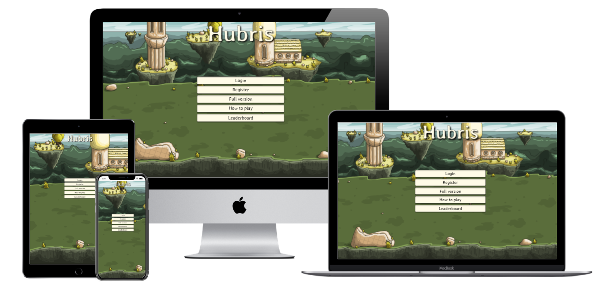

# Table of Contents

- [UX](#user-experience-(ux))
  - [User stories](#user-stories)
  - [Design](#design)
  - [Mockup](#mockup)
- [Features](#features)
- [Technologies Used](#technologies-used)
- [Testing](#testing)
- [Deployment](#deployment-and-cloning)
- [Credits](#credits)

# User experience (ux)

## User stories:

- As a site owner, i want to:
    1. Offer a replayable game. That users enjoy playing again and again.(game should be different every time ea. Random selection of enemies and cards. Also different starting hero)
    2. Entice people to buy the full version.(clear explanation of what u get and easy access to the checkout. Also the free version as a teaser.)
    3. Make it as easy as possible (minimize #actions) for users to register and login. (username/password)
    4. Make it as easy as possible (minimize #actions) to pay for the full version. (google pay / creditcard)
    5. Add / edit / delete cards, starting player stats, and enemies in the database.
    6. Have a secured access to the admin.(provided by oath)
<br><br>
- As a first time user, i want to:
    1. Login / register with username/password.
    2. Reset my password.
    3. Learn the game rules.
    4. Learn the UI of the game.
    5. See what monsters and spells are in the game through a wiki page.
    6. Try the free version to see if i like the game.
    7. Find out what i get in the full version. (also after i play the free game)
    8. See an indication that i’m on the free version.
    9. Pay for the full version with the least amount of effort.
<br><br>
- As a paying user, i want to:
    1. Play the game now. (minimize #actions after login: play now? / menu)
    2. See what monsters and spells are in the game.
    3. Access the leaderboard.
    4. Continue my game or start a new one.
    5. Have a replayable game. That i enjoy playing again and again.
<br><br>
- As a player who plays the game, i want to:
    1. play in fullscreen
    2. Select a wizard to play with.
    3. See all the properties of the different wizards.
    4. Have a clear overview of the cards in my hand.
    5. See all spell information on the cards: title, description, phase, style, effects and cost.
    6. Select  a card from my deck to play.
    7. Discard a card from my hand.
    8. Decide if i want to go up a level.
    9. See an indication of the level i’m at.
    10. See an indication of the battle phase i’m in.
    11. See all my stats in the stats bar.
    12. See the stats of my enemies.
    13. See my score.
    14. See the spell effects and cost in the spell selection bar
    15. Select a spell available to me in this phase.
    16. Select which enemy to attack.
    17. Skip to the next phase.
<br><br>
- As a player who plays the game on mobile, i want to:
    1. Have a fullscreen gaming experience
    2. Play the game in landscape mode only so i get the best experience.
<br><br>
- As a user who uses the wiki page, i want to:
    1. search cards by type, free version availability or attack-phase
    2. sort cards by cost

<br><br>

# Design

### Fonts

Fonts used in this project are:<br>
For all text and the title:<br>
[Stylish](https://fonts.google.com/specimen/Stylish#about)<br>
And for the numbers on cards and menu's:<br>
[Roboto](https://fonts.google.com/specimen/Roboto?query=roboto)<br>

## Database schema

### Original database design:

This original design was made in dbdiagram, and can be acessed via this [link](https://dbdiagram.io/d/613622d3825b5b0146f53245)<br>
Under my diagrams > Huberis<br>
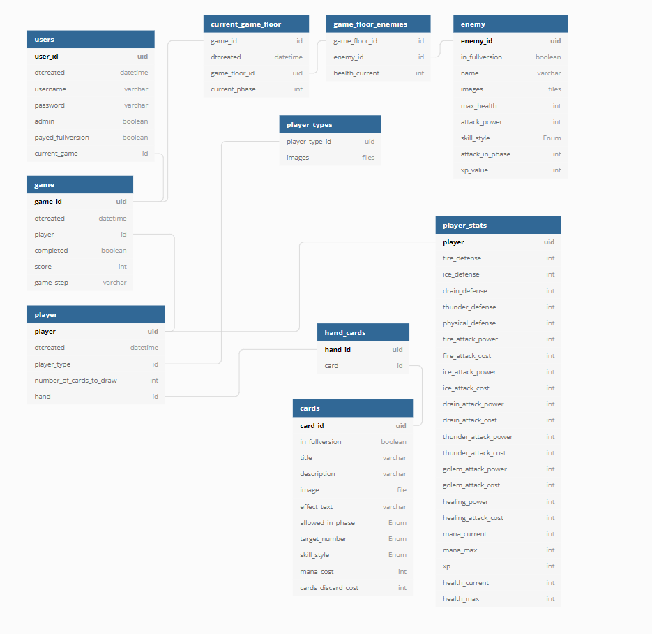

During development some of these designs turned out to be incomplete or needed adjustments.<br>
This resulted in some changes to the db models.<br>
This can be found under diagrams > Huberis2.0<br>
The final versions look like this:<br>
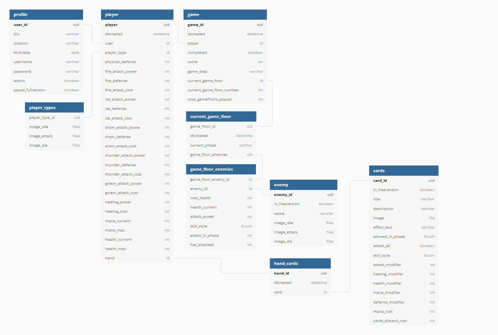

## Imagery

All imagery used in this project came from [craftpix](https://craftpix.net/all-game-assets/)

## Mockup

-  The mockup design of this site was made in Figma. U can view it [here](https://www.figma.com/file/p55Dty6wFf4cGkjfJhYHT4/Hubris-1.0?node-id=0%3A1) 

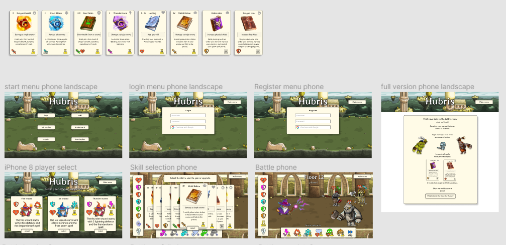

# Features

- main menu with adaptive buttons
- cards selection menu
- player selection menu
- continue current game if there is one
- card discard menu
- payment page
- full feature unlock when payment is made
- animations on buttons on click amd mouseover
- animations on selections of enemies

## future features

- animations on attacks an deaths of characters
- Google signin
- apple pay and ideal as payment options
- sound effects
- background music

# technologies used:

### Languages Used

-   [HTML5](https://en.wikipedia.org/wiki/HTML5)
    - HTML5 was used to build the main structure and content of the page.
-   [CSS3](https://en.wikipedia.org/wiki/Cascading_Style_Sheets)
    - CSS3 was used to give the html styling and layout.
    And to make the page responsive to differentscreen sizes.
-   [Javascript](https://nl.wikipedia.org/wiki/JavaScript)
    - Javascript was used for enemy selection and player action process.
-   [Python](https://www.python.org/)
    - Python was used for writing all backend code.
-   [Jinja](https://jinja.palletsprojects.com/en/3.0.x/)
    - Jinja was used for writing the template code.


### Frameworks, Libraries & Programs Used

1. [jQuery:](https://jquery.com/)
    - jQuery Used in script files.
1. [Git](https://git-scm.com/)
    - Git was used for version control by utilizing the terminal in gitpod to regularly commit, with comments, to Git and Push to GitHub.
1. [GitHub:](https://github.com/)
    - GitHub was used to store the projects code and assets.
1. [Django:](https://docs.djangoproject.com/en/3.2/)
    -Django was used set up project and all apps.
1. [Figma:](https://figma.com/)
    - Figma was used to create the website design and prototype.
1. [Heroku:](https://www.heroku.com)
    - Heroku was used to deploy the app.
1. [dbdiagram](https://dbdiagram.io/)
    - To design the database schema.
1. [Aws](https://eu-central-1.console.aws.amazon.com/)
    - To store and serve static all files
1. [ezgif](https://ezgif.com/maker)
    - To create animated gif for player types


# Testing

All testing can be found [here](TESTING.md).

# Deployment and cloning

### Clone this repository:
### In linux:
To find the link, go to the "code" dropdown menu in this repository.<br>
Click the clipboard icon next to the url.<br>
In your terminal type:<br>

```
$mkdir <jour project directory>
$git init <jour project directory> (to set up a new repository)
$git clone https://github.com/JorisPaarde/Hubris.git
```

In Windows:

follow [these](https://www.jcchouinard.com/clone-github-repository-on-windows/) steps.

Install all requirements through the requirements.txt file:
```
pip install -r requirements.txt
```

## To deploy this Project:

### Create your heroku account:
- Create your account on Heroku here: https://signup.heroku.com/login

- Create a new app on heroku:

- Go to: https://dashboard.heroku.com/apps
select new, create new app from the dropdown menu on the right.
Enter your app-name and region and click create app.
Under deployment method, select github.

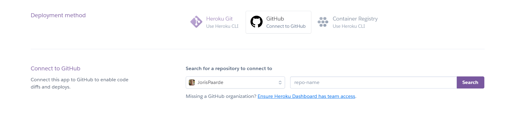

- Select your repository and connect.

- In resources search for the heroku-postgres addon, select Hobby Dev – Free.
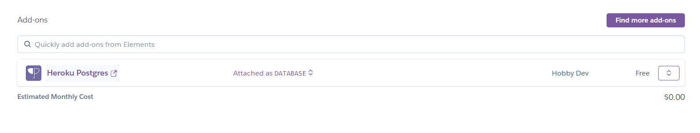

### Set up your AWS s3 bucket:[here](https://aws.amazon.com/s3/)
    - To obtain your AWS_ACCESS_KEY_ID and AWS_SECRET_ACCESS_KEY.

### Get your Django SECRET-KEY: [here](https://djecrety.ir/)

### To set up Stripe: follow this [link](https://stripe.com/):
- set up your account.
- add your product:
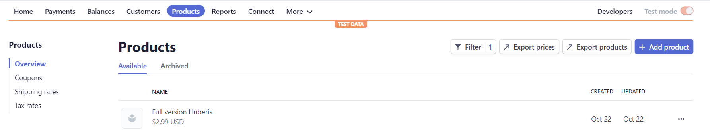<br>
- get your api keys:
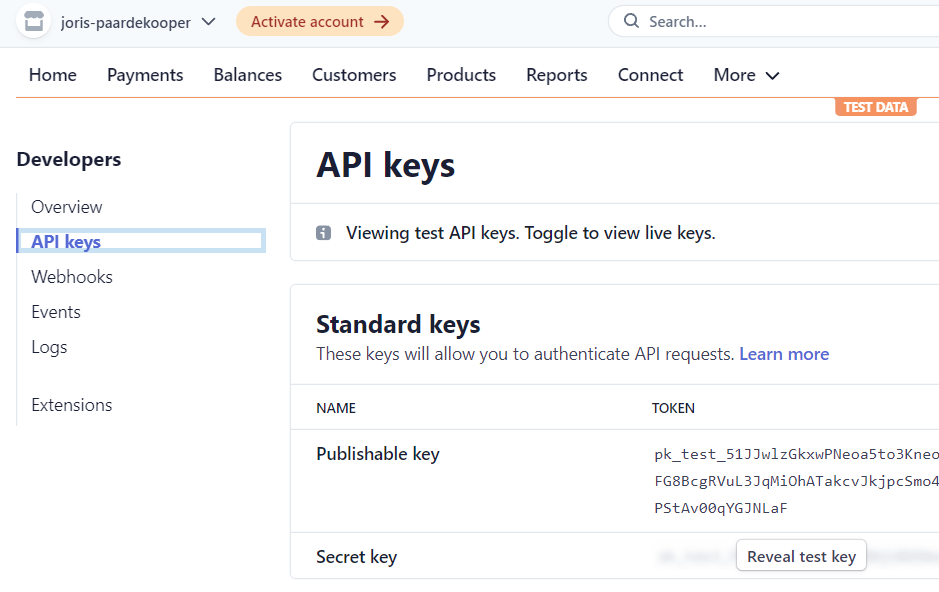<br>
- Add a webhook endpoint for your site: 'www.yourdomain/checkout/wh' and retrieve the wh-signing-secret here:
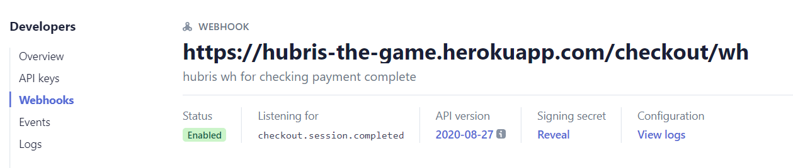<br>


- Go back to heroku, settings, config vars and enter the variables for:<br>
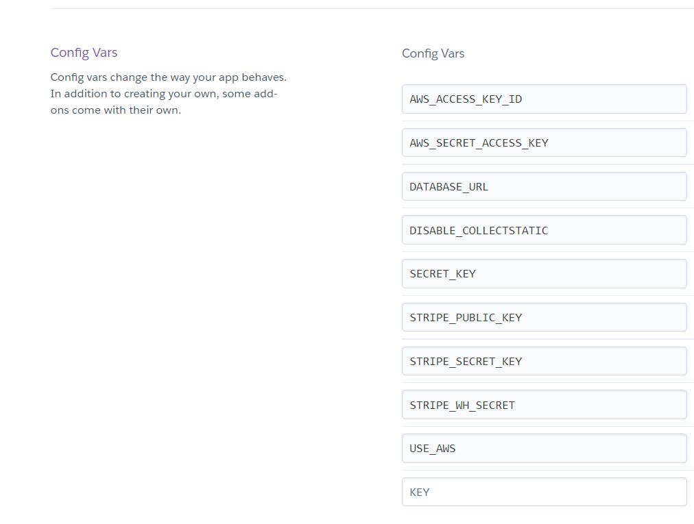<br>

<br><br>
- Go to deploy and at the bottom of the page manually deploy your main github branch.

Your app is now deployed and ready to run.
At the top of the page in heroku click open app to run it.

# Credits

Thanks to Precious for his mentoring.<br>
Thanks to igor for his wise words:<br>
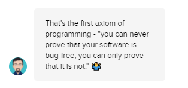<br>
Thanks to John for being there with me:<br>
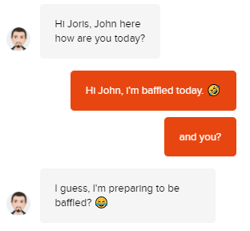<br>
Thanks to Alan for the moral support:<br>
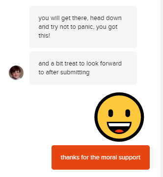<br>
Special thanks to Chris Zielinski who had ALL the answers, for everyone on the full stack frameworks slack channel.<br>
And of course all the fine people on slack.<br>


## Code

The following code was copied (and in some cases slightly altered) from external sources:

- in profile.models
https://simpleisbetterthancomplex.com/tutorial/2016/07/22/how-to-extend-django-user-model.html#onetoone
- in settings
https://github.com/Code-Institute-Solutions/boutique_ado_v1/blob/a07c1ca5a3b973eb47e5c944829cea06ead3936d/boutique_ado/settings.py
- in checkout.views:
https://testdriven.io/blog/django-stripe-tutorial/
