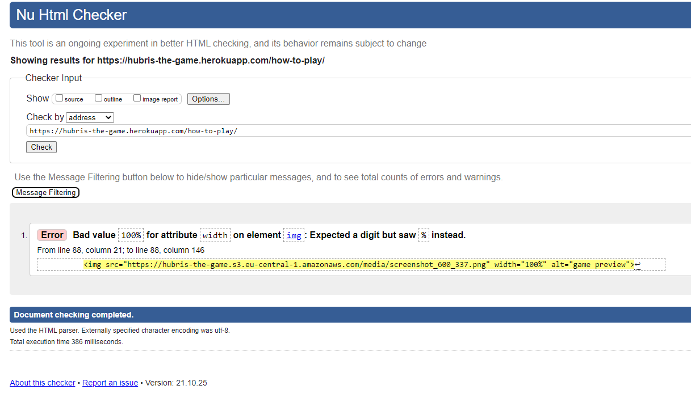
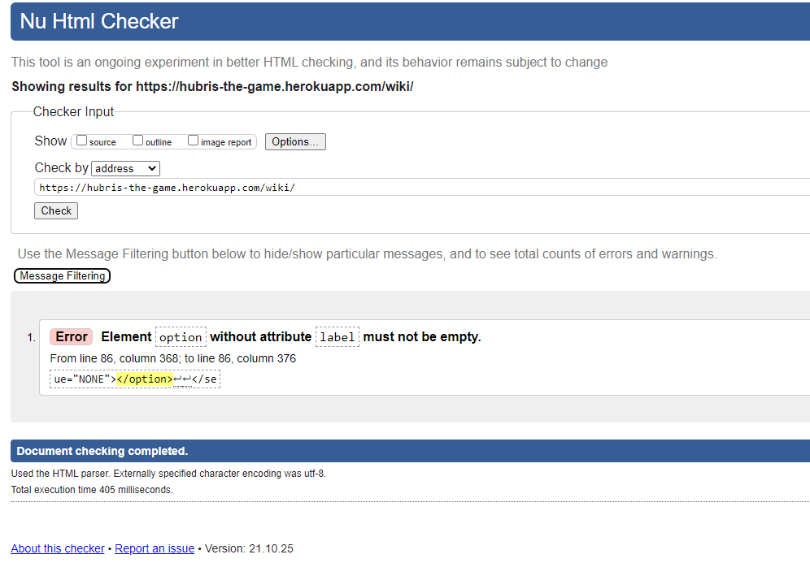

# Tests and bugreports:

- [User story testing](#user-story-testing)
- [Responsive layout testing](#responsive-visual-layout-testing)
- [Feature testing](#feature-testing)
- [Browser testing](#browser-testing)
- [Validators](#validators)
- [Lighthouse Report](#lighthouse-report)
- [Bugs during development](#bugs-encountered-during-development-and-their-fixes)

# User story testing:

## General functionality:

 
 

### As a Site owner, I want to:
---
user story|implementation
----|----
Offer a replayable game. That users enjoy playing again and again.(game should be different every time ea. Random selection of enemies and cards. Also different starting hero)|Both cards and enemy stats are randomly generated, no game is the same.
Entice people to buy the full version.(clear explanation of what u get and easy access to the checkout. Also the free version as a teaser.)|Free limited version is available to players that haven't payed, all cards that are available in the full game can be searched trough in the wiki. Checkout is simple and intuitive.
Make it as easy as possible (minimize #actions) for users to register and login. (username/password)|register and login buttons are clearly accessable, no unnessecary info needs to be entered to register.
Make it as easy as possible (minimize #actions) to pay for the full version. (google pay / creditcard)|Stipr handles payments easily and effeciently.
Add / edit / delete cards, player stats, and enemies in the database.|Admin gives full access to the db.
Have a secured access to the admin.(provided by oath)|Only users with Staff status can access the database.

 
 

### As a first time user, I want to:
---
user story|implementation
----|----
Login / register with username/password.|When a user is not logged in, these are clearly represented in the main menu. 
Learn the game rules.|Game rules are explained on the how-to-play page.
See what spells are in the game through a wiki page.|The wiki page gives a full search of all cards capability to the user.
Try the free version to see if i like the game.|Free verion enables first 5 floors and a limited amount of enemys and cards to be played.
Find out what i get in the full version. (also after i play the free game)|Complting the free game redirects the player to the full version page which shows the user what he/she gets as extra's in the full game.
See an indication that i’m on the free version.|This is indicated on the battle screen.
Pay for the full version with the least amount of effort.|Stripe payment requires only credit card data to fulfill the order.

 
 

### As a paying user, I want to:
---
user story|implementation
----|----
Play the game now. (minimize #actions after login: play now? / menu)|After logging in, the player can start a game in 1 or 2 clicks, depending on wether he/she has a game to continue.
See what spells are in the game.|The wiki page allows full search of the cards in the database.
Access the leaderboard.|Available via the main menu
Continue my game or start a new one.|When a player has an unfinished game open, this choice is presented.
Have a replayable game. That i enjoy playing again and again.|Since the cards and enem's are randomly selected, all games will be different.

 
 

### As a player who plays the game, i want to:
---
user story|implementation
----|----
Play in fullscreen.|Game screen is set to full width and height of the screen.
Select a wizard to play with.|Three wizard types are presented for the player to choose from, when starting a new game.
See all the properties of the different wizards.|Player stats are shown on the player type cards.
Have a clear overview of the cards in my hand.|All cards are shown in full view for the player to select from.
See all spell information on the cards: title, description, phase, style, effects and cost.|These are all clearly shown on all cards, if applicable.
Select  a card from my deck to play.|A play button with clear mouse over effect is placed under each card to do this.
Discard a card from my hand.|A discard button with clear mouse over effect is placed under each card to do this.
Decide if i want to go up a level.|Player is given this choice after card discard step. With clear text to explain the options given.
See an indication of the level i’m at.|Shown at the top of the battle screen.
See an indication of the battle phase i’m in.|Shown at the top of the battle screen.
See all my stats in the stats bar.|Shown on the left in the battle screen.
See the stats of my enemies.|Shown above or below the enemy in the battle screen.
See my score.|Shown at the top of the battle screen.
See the spell effects and cost in the spell selection bar.|Shown at the bottom of the battle screen.
Select a spell available to me in this phase.|Indicated by the fact that the color is not grey, but the color corresponding to the skill style.
Select which enemy to attack.|Enemies get a red glow to indicate you are required to select one. mouseover gives an indication that they are clickable, clicking gives a short animation on the red glow surrounding the enemy.
Skip to the next phase.|a skipp button is present in the action bar at the bottom of the battle screen.

 
 

### As a player who plays the game on mobile, i want to:
---
user story|implementation
----|----
Have a fullscreen gaming experience.|The game screen is blocked on portrait mode, allowing a fullscreen layout on landscape.
Play the game in landscape mode only so i get the best experience.|Handled by javascript, checking if the width of the screen is bigger than the height.

 
 

### As a user who uses the wiki page, i want to:
---
user story|implementation
----|----
Search cards by type.|A multiple choice field with all options is placed at the wiki page.
Search cards by free version availability.|A toggle to also search cards from the full version is placed at the wiki page.
Search cards by allowed-phase.|A multiple choice field with all options is placed at the wiki page.
 
 

# Responsive visual layout testing

Page|expected behaviour|testing|result|Fix(if needed)
---|---|---|---|---
Card selection screen.|Cards all fully displayed on screen|Tested on all screensizes in devtools and on physical iphone8|cards were partially unreachable in physical iphone8|Removed fixed position to allow scrolling to see the full card. 
Index page.|All buttons and title are fully visible on screen, both on landscape and portrait mode.|Tested on all screensizes in devtools and on physical iphone8|Correct.|None.
Battle page.|All enemys and icons are fully visible on screen, only on landscape mode. On portrait mode the user is asked to rotate the screen.|Tested on all screensizes in devtools and on physical iphone8|Correct.|None.
Player-select page.|All player options, menu and title are fully visible on screen, only on landscape mode. On portrait mode the user is asked to rotate the screen.|Tested on all screensizes in devtools and on physical iphone8|Correct.|None.
proceed-to-next-floor page.|All Cards are fully visible on screen, including hubris question and buttons. Only on landscape mode. On portrait mode the user is asked to rotate the screen.|Tested on all screensizes in devtools and on physical iphone8|Correct.|None.
Register page.|All buttons, input fields and title are fully visible on screen, both on landscape and portrait mode.|Tested on all screensizes in devtools and on physical iphone8|Correct.|None.
Login page.|All buttons and title are fully visible on screen, both on landscape and portrait mode.|Tested on all screensizes in devtools and on physical iphone8|Correct.|None.
Leaderboard page.|All buttons and title are fully visible on screen, both on landscape and portrait mode.|Tested on all screensizes in devtools and on physical iphone8|Correct.|None.
How-to-play page.|All buttons and title are fully visible on screen, both on landscape and portrait mode.|Tested on all screensizes in devtools and on physical iphone8|Correct.|None.
Wiki page.|All buttons and title are fully visible on screen, both on landscape and portrait mode.|Tested on all screensizes in devtools and on physical iphone8|Correct.|None.
 
 

# Feature testing

feature|expected behaviour|testing|result|Fix(if needed)
---|---|---|---|---
Main menu with adaptive buttons|Buttons only show when applicable and have hover effect|mouse over , login, logout and paying the full version all have the desired effect.|None.
Cards selection menu|selecting a card removes it from the players hand and adds the corect stats to the player|Played all cards and checked db and player stats after playing.|Correct|None.
Player selection menu|Player is presented with a continue option if a game is unfinished, player starts game with corrct player type and stats when selectiong a player.|Start new game and try to start a new game after having left this game.|Correct.|None.
Continue current game if there is one|Game starts at point where the player left off after leaving the last game.|Stop a game aftr playing a few floors, then restart the game via the continue button.|Correct.|None.
Card discard menu|selecting a card removes it from the players hand|discard a card and checked db after discarding.|Correct|None.
Payment page|Completed payment (checked via webhook) results in a redirect to the success page and updates the current users profile to having payed the full version. Cancelled payment redirects to cancelled payment page.|Made correct payment, cancelled a payment and tried payment with failed payment card.|All behaviour was as intended.|None.
Full feature unlock when payment is made|User gets full access to all features of the game after payment is confirmed|Made sucessfull payment and checked db, played a few floors.|Payment was successfully registered, enemies and cards where unlocked.|None.
Animations on buttons on click and mouseover|Buttons animate on click and mouseover.|Cilcked / mouse over on all buttons on site.|Correct.|None.
Animations on selections of enemies|Monsters get glowing effect after selecting an action, and on clicking the selected enemy.|Clicked action icon and after that clicked an enemy|Correct.|None.

 

# Browser testing

Browser|layout correct|functionality correct|Issues
---|---|---|---
Opera|Yes|Yes|None
Chrome|Yes|Yes|None
Edge|Yes|Yes|None
Firefox|Yes|Yes|None

 

# Validators

## To validate the html and CSS [W3C markup validation](https://validator.w3.org/) was used.

 

## index: no errors.
## battle: no errors.
## player-select: no errors.
## proceed-to-next-floor: no errors.
## register: no erros.
## login: no errors.
## leaderboard: no errors.
## how-to-play:

 
Adjusted width and added css.
 

## wiki:

 
Solved by adding 'None' as input to the field.

 
 
For the CSS the results were as follows:

### base: No errors.
### battle: No errors.
### full-version: No errors.
### profiles: 1 error, added unit to values on current-game-menu to fix it.
### wiki: No errors.

 

 

## For Javascript validation [JSHint](https://jshint.com/) was used.

### actions: After some minor semicolon and defining variable adjustments, no errors.
### checkout: One undefined variable: 9 Stripe. This is the stripe.js script, so this error is ignored.
### force_landscape: No errors

 

## For python validation [pep8online](http://pep8online.com/) was used.

### battle: utils : Added module docstring. 
### battle: views : 
Added module docstring.
One line to long, but since this is only 1 variable with 1 added to it this was igored.
### battle: models : 
Added module docstring.
Class names didn't conform to PascalCase naming style. Adjusted classnames.
### battle: admin :
### battle: urls :

### checkout: urls :
### checkout: views :

### profiles: views :
### profiles: utils :
### profiles: models :
### profiles: urls :

### wiki: forms :
### wiki: urls :
### wiki: views :

### All Class 'Foo' has no objects member error where ignored, since this is a known pylint ussue that can be ignored.
 

# Lighthouse Report 

## desktop
### index.html:
### battle.html:
### player-select.html:
### proceed-to-next-floor.html:
### register.html:
### login.html:
### leaderboard.html:
### how-to-play.html:
### wiki.html:

## mobile
### index.html:
### battle.html:
### player-select.html:
### proceed-to-next-floor.html:
### register.html:
### login.html:
### leaderboard.html:
### how-to-play.html:
### wiki.html:
 

# Bugs encountered during development and their fixes:

bug|fix
---|---
Menu button was not clickable in game screen. |Fixed by making sure no div was blocking it with a higher z-index value.
Player selection layout broke on wider screens. |Pushed text to the bottom of the container.
hand-cards where added but not associated with player hand. |Changed model to many to many field and corrected card draw function.
When comparing players hand card to the cards in the database the values seemed the same, but did not trigger an if equal statement. |Fixed by adding a lower statement to both values.
Back button press after playing a card made it possible to play infinite cards. |Added a check for the gamestep to be '2' to prevent this.
Restarting the game resulted in an ever increasing list of hand cards. |Deleting them when restarting a game.
Restarting a game resulted in no enemies shown. |Deleting the old ones in the database fixed this.
Possibility to have 2 open games resulted in errors. |Created try except logic to complete the oldest game.
Player having completed games resulted in MultipleObjectsReturned. |Added check in all views to get the game that is not finished.
After deployment, pickmonsters function trew an error on the length of skillstyle and attackphase values. |Changed input from value ('LN') to key ('Lightning').
The player death view did not run but, gave a 200 status code... |Moving it to another app fixed this. why? no idea...
Attacking a player resuted in errors. |updated check for enemy to: "hasattr(target, 'enemy')" instead of "target.enemy".
When dieing, player needed to discard multiple cards and draw new ones to get to 8 cards again. |Now draws cards function draws new cards to fill hand to 8.
After player death, gamefloor enemy's where not deleted, causing the database to fill with unused enemys. |Added deleting all enemys to the player death function.
When starting a new game, all scores where deleted from a player, because the player was deleted. |Fixed by resetting stats rather than deleting player.
Enemies had mana or heal skill selected, resulting in attack icon errors. |Added separate enemy attackstyle list to settings.
When killing enemys or being attacked, the order of the enemy's changed in the template due to the data not being deterministic. |Added a meta base class to order the data by pk.

